Run the game
---
Execute following script in `client` folder:
```javascript
npm start
```
Open your browser at [http://localhost:1234](http://localhost:1234)
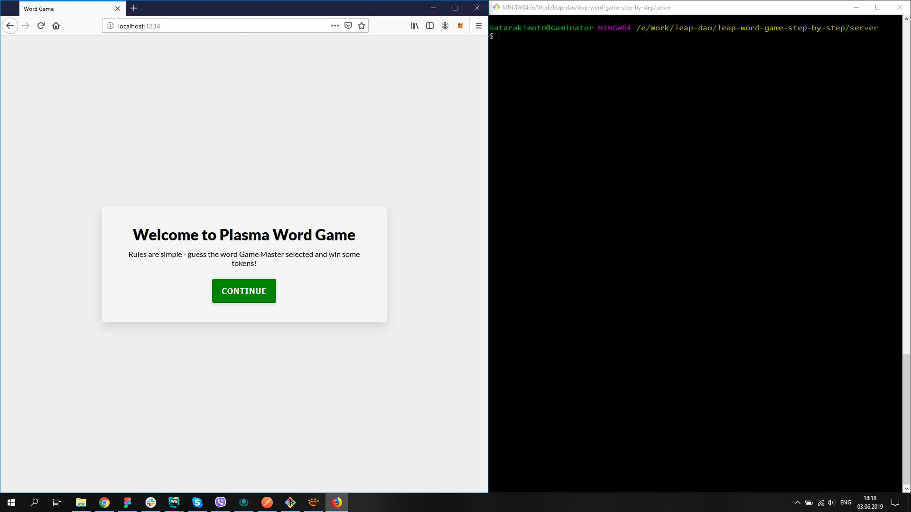


Activate Metamask:
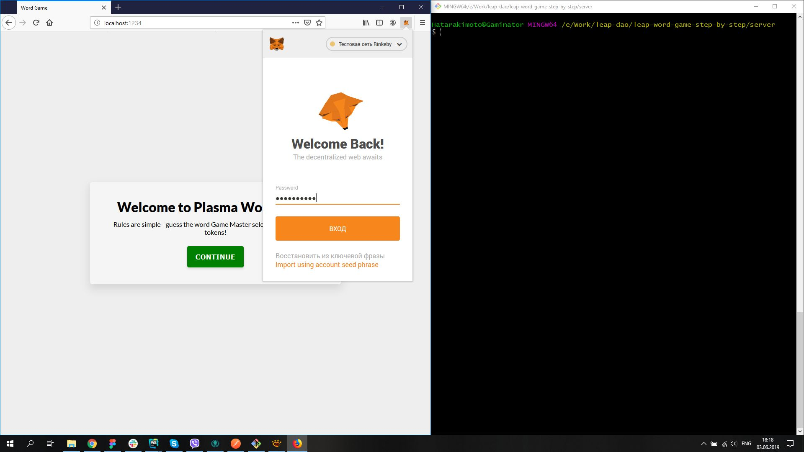


Pick Rinkeby test network:
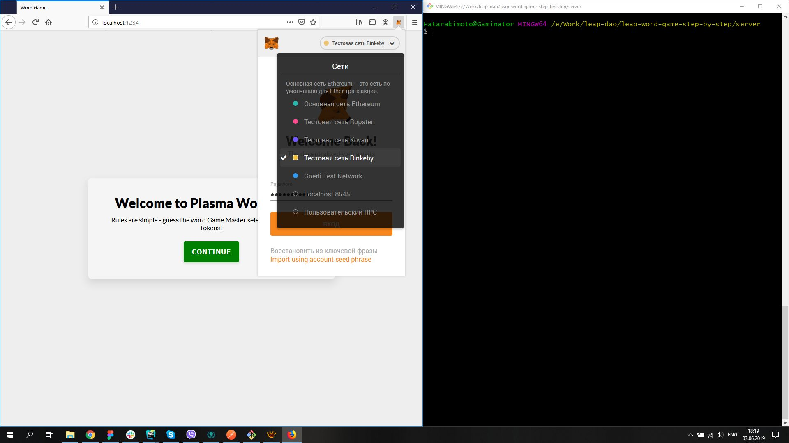

Now start the server by running in `nodemon start` in the `server` folder: 
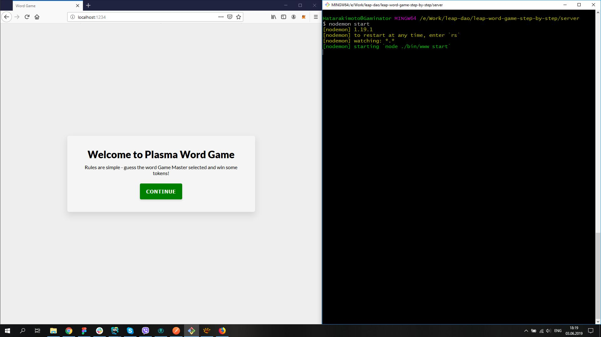

Press "Continue":
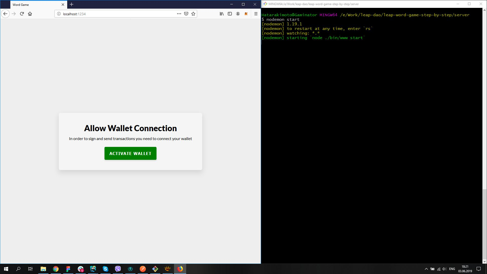

Connect Metamask wallet to page:
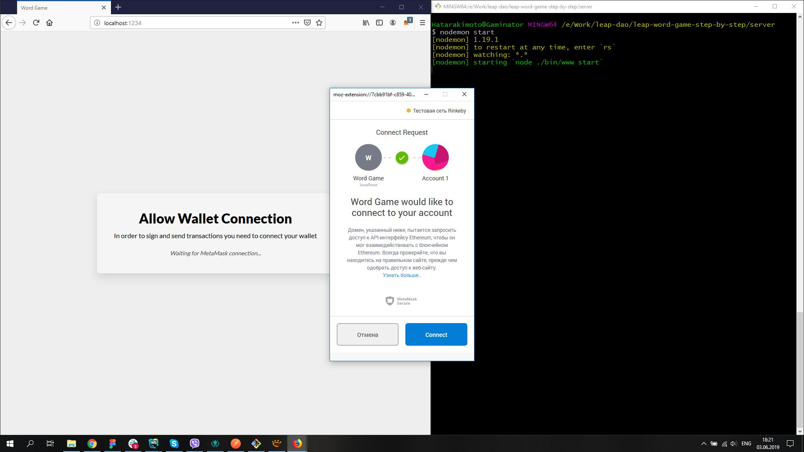

Press "Play Game":
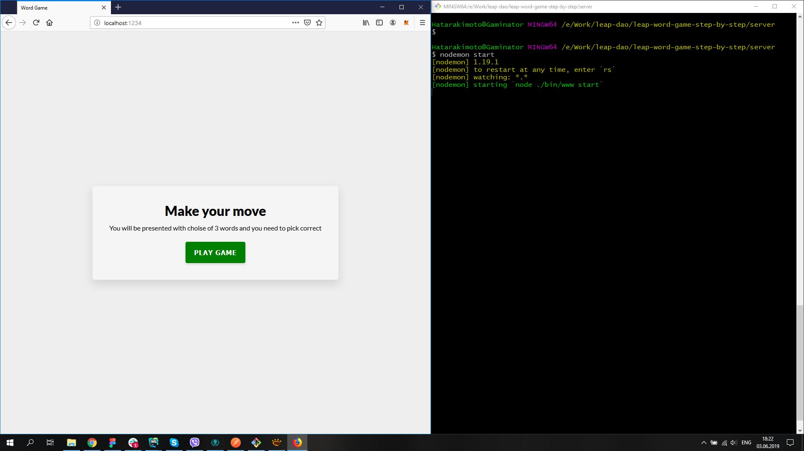

Press "Start Round":
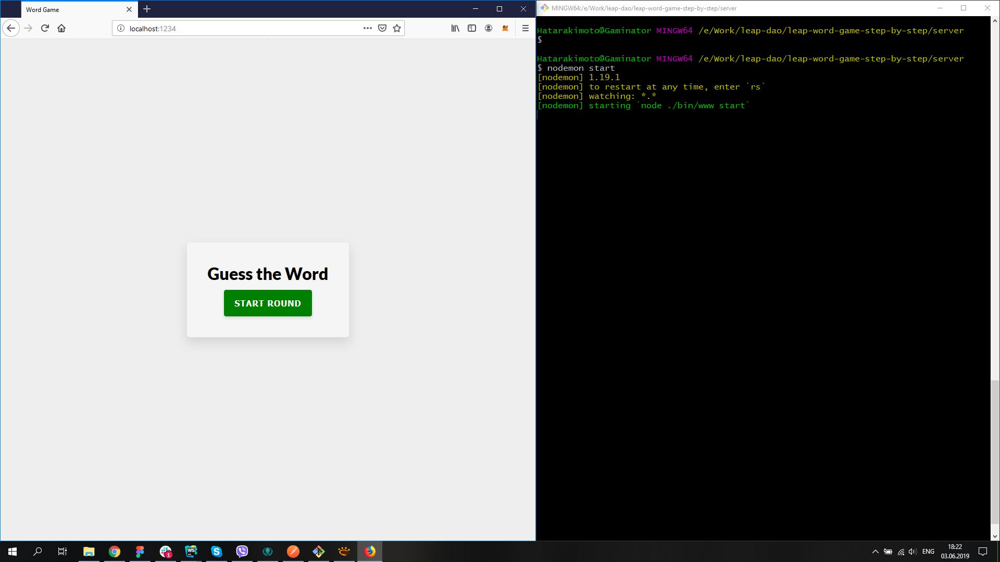

You will see that client UI changed and that request hit the server
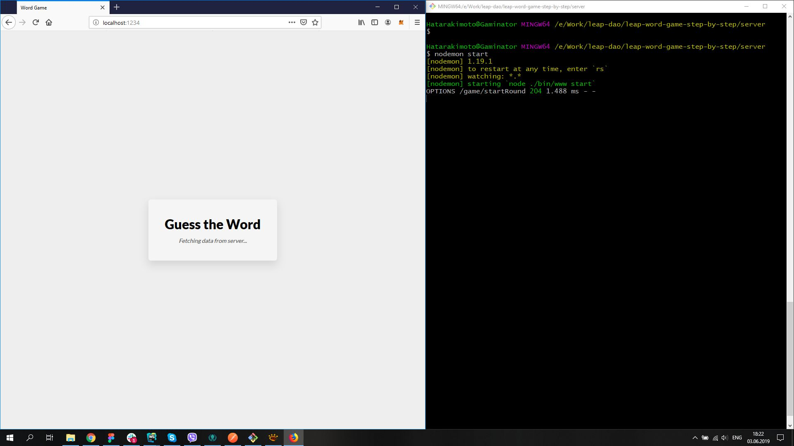

Pick one of the words:
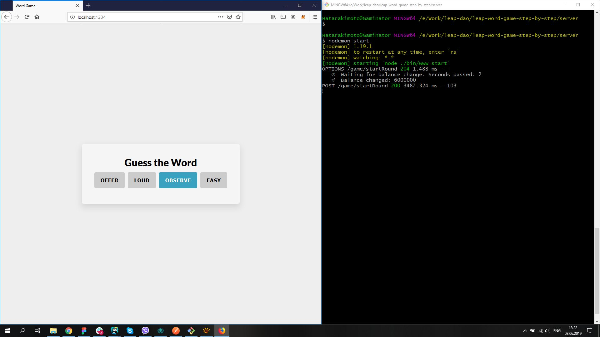

Approve your bet(press "Sign" button on the right)
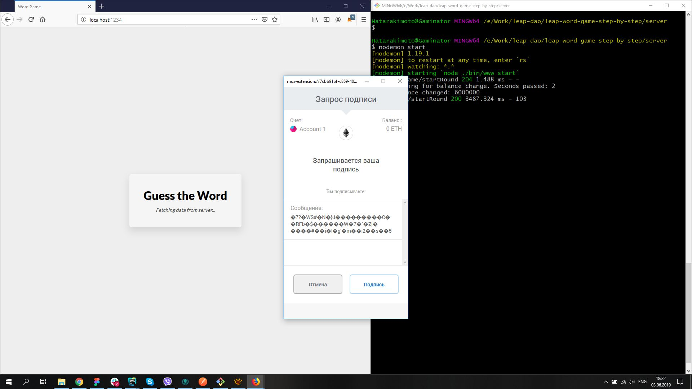

New request is sent to server
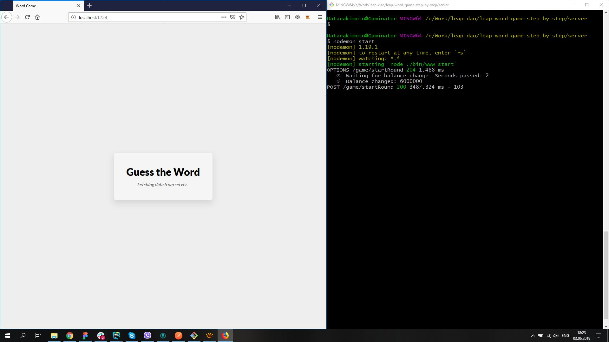

Round is processed on server, client got receipt back and show result of the round
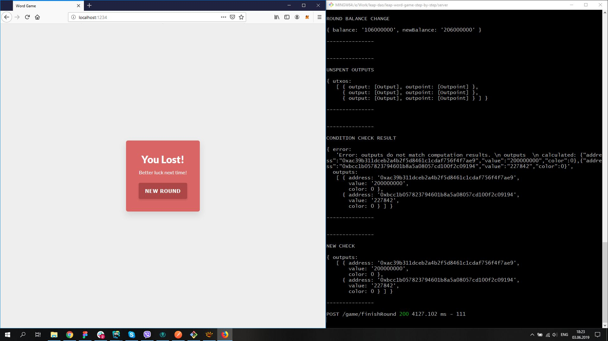

You can press "New Round" button to start game anew
